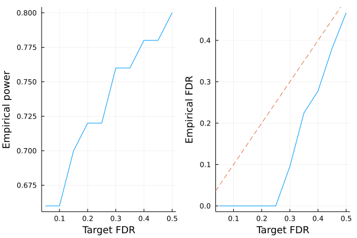

# Fixed-X knockoffs

This tutorial generates fixed-X knockoffs and checks some of its basic properties. The methodology is described in the following paper

> Barber, Rina Foygel, and Emmanuel J. Candès. "Controlling the false discovery rate via knockoffs." The Annals of Statistics 43.5 (2015): 2055-2085.


!!! note
    For fixed-X knockoffs, we assume $n > 2p$ where $n$ is sample size and $p$ is number of covariates, although in principle this method can be adapted to work for $n > p$ case.


```julia
# load packages needed for this tutorial
using Knockoffs
using Plots
using Statistics
using StatsBase
using Random
using GLMNet
using LinearAlgebra
gr(fmt=:png);
```

## Generate knockoffs

We will

1. Simulate Gaussian design matrix
2. Standardize the columns to mean 0 variance 1
3. Generate knockoffs

Both equi-correlated and SDP knockoffs are supported. 


```julia
Random.seed!(2022)   # set random seed for reproducibility
X = randn(1000, 200) # simulate Gaussian matrix
standardize!(X)      # normalize columns

# make equi-correlated and SDP knockoffs
Aequi = fixed_knockoffs(X, :equi)
Asdp = fixed_knockoffs(X, :sdp);
```

The return type is a `Knockoff` struct, which contains the following fields

```julia
struct Knockoff{T}
    X::Matrix{T}    # n × p original design matrix
    X̃::Matrix{T}    # n × p knockoff of X
    s::Vector{T}    # p × 1 vector. Diagonal(s) and 2Σ - Diagonal(s) are both psd
    Σ::Matrix{T}    # p × p gram matrix X'X
    Σinv::Matrix{T} # p × p inv(X'X)
end
```

Thus, to access these fields, one can do


```julia
X̃ = Asdp.X̃
s = Asdp.s
Σ = Asdp.Σ
Σinv = Asdp.Σinv;
```

We can check some knockoff properties. For instance, is it true that $X'\tilde{X} \approx \Sigma - diag(s)$?


```julia
# compare X'X and Σ-diag(s) visually
[vec(X'*X̃) vec(Σ - Diagonal(s))]
```


    40000×2 Matrix{Float64}:
     998.0      998.0
     -18.5421   -18.5421
     -25.4908   -25.4908
     -34.946    -34.946
      20.1673    20.1673
      51.0641    51.0641
      14.7028    14.7028
     -24.1644   -24.1644
     -46.411    -46.411
     -33.7503   -33.7503
      -4.25934   -4.25934
     -24.1531   -24.1531
      13.1971    13.1971
       ⋮        
      20.4727    20.4727
     -13.4668   -13.4668
     -13.3521   -13.3521
      33.889     33.889
      30.8905    30.8905
     -30.8344   -30.8344
      42.4959    42.4959
       4.39748    4.39748
       2.57332    2.57332
      -7.19466   -7.19466
       9.84951    9.84951
     998.0      998.0


## LASSO example

Let us apply the generated knockoffs to the model selection problem. In layman's term, it can be stated as

> Given response $\mathbf{y}_{n \times 1}$, design matrix $\mathbf{X}_{n \times p}$, we want to select a subset $S \subset \{1,...,p\}$ of variables that are truly causal for $\mathbf{y}$. 

### Simulate data

We will simulate 

$$\mathbf{y} \sim N(\mathbf{X}\mathbf{\beta}, \mathbf{\epsilon}), \quad \mathbf{\epsilon} \sim N(0, 1)$$

where $k=50$ positions of $\mathbf{\beta}$ is non-zero with effect size $\beta_j \sim N(0, 1)$. The goal is to recover those 50 positions using LASSO.


```julia
# set seed for reproducibility
Random.seed!(999)

# simulate true beta
n, p = size(X)
k = 50
βtrue = zeros(p)
βtrue[1:k] .= randn(50)
shuffle!(βtrue)

# find true causal variables
correct_position = findall(!iszero, βtrue)

# simulate y
y = X * βtrue + randn(n);
```

### Standard LASSO

Lets try running standard LASSO. We use LASSO solver in [GLMNet.jl](https://github.com/JuliaStats/GLMNet.jl) package, which is just a Julia wrapper for the GLMnet Fortran code. 

How does it perform in power and FDR?


```julia
# run 10-fold cross validation to find best λ minimizing MSE
lasso_cv = glmnetcv(X, y)
λbest = lasso_cv.lambda[argmin(lasso_cv.meanloss)]

# use λbest to fit LASSO on full data
βlasso = glmnet(X, y, lambda=[λbest]).betas[:, 1]

# check power and false discovery rate
power = length(findall(!iszero, βlasso) ∩ correct_position) / k
FDR = length(setdiff(findall(!iszero, βlasso), correct_position)) / count(!iszero, βlasso)
power, FDR
```


    (0.96, 0.5428571428571428)


It seems LASSO have power 96% (it missed only 2/50 predictors), but the false discovery rate is 54%. This means that although LASSO finds almost every predictor, more than half of all discoveries are false positives. 

### Knockoff+LASSO

Now lets try applying the knockoff methodology. Recall that consists of a few steps 

1. Run LASSO on $[\mathbf{X} \mathbf{\tilde{X}}]$
2. Compare coefficient difference statistic $W_j$ for each $j = 1,...,p$. Here we use $W_j = |\beta_j| - |\beta_{j, knockoff}|$
3. Choose target FDR $0 \le q \le 1$ and compute 
$$\tau = min_{t}\left\{t > 0: \frac{{\#j: W_j ≤ -t}}{{\#j: W_j ≥ t}} \le q\right\}$$


```julia
# step 1
knockoff_cv = glmnetcv([X X̃], y)
λbest = knockoff_cv.lambda[argmin(knockoff_cv.meanloss)]
βestim = glmnet([X X̃], y, lambda=[λbest]).betas[:, 1]

# target FDR is 0.05, 0.1, ..., 0.5
FDR = collect(0.05:0.05:0.5)
empirical_power = Float64[]
empirical_fdr = Float64[]
for fdr in FDR
    βknockoff = extract_beta(βestim, fdr) # steps 2-3 happen here

    # compute power and false discovery proportion
    power = length(findall(!iszero, βknockoff) ∩ correct_position) / k
    fdp = length(setdiff(findall(!iszero, βknockoff), correct_position)) / max(count(!iszero, βknockoff), 1)
    push!(empirical_power, power)
    push!(empirical_fdr, fdp)
end

# visualize FDR and power
power_plot = plot(FDR, empirical_power, xlabel="Target FDR", ylabel="Empirical power", legend=false)
fdr_plot = plot(FDR, empirical_fdr, xlabel="Target FDR", ylabel="Empirical FDR", legend=false)
Plots.abline!(fdr_plot, 1, 0, line=:dash)
plot(power_plot, fdr_plot)
```





**Conclusion:** Compared to LASSO, knockoff's empirical FDR is controlled below the target FDR (dashed line). Controlled FDR is compensated by a small price in power. If this experiment is repeated multiple times, we expected the empirical FDR to hug the target (dashed) line more closely. 
