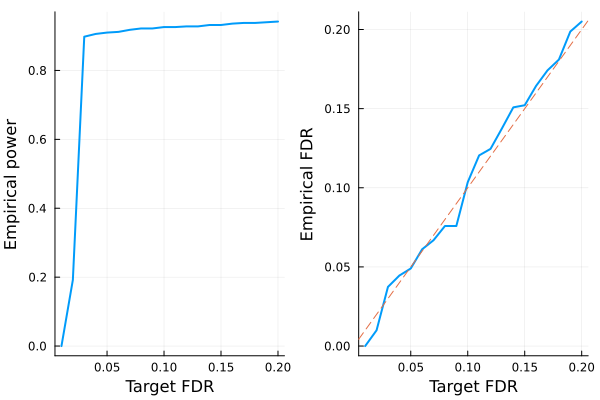

# Fixed-X knockoffs

This tutorial generates fixed-X knockoffs and checks some of its basic properties. The methodology is described in the following paper

> Barber, Rina Foygel, and Emmanuel J. Candès. "Controlling the false discovery rate via knockoffs." The Annals of Statistics 43.5 (2015): 2055-2085.


!!! note
    For fixed-X knockoffs, we assume $n > 2p$ where $n$ is sample size and $p$ is number of covariates, although in principle this method can be adapted to work for $n > p$ case.


```julia
# load packages needed for this tutorial
using Knockoffs
using Random
using GLMNet
using LinearAlgebra
using Distributions
using Plots
gr(fmt=:png);
```

## Generate knockoffs

We will

1. Simulate Gaussian design matrix
2. Generate knockoffs. Here we generate maximum entropy (ME) knockoffs as described in [this paper](https://arxiv.org/abs/2011.14625). ME knockoffs tend to have higher power over SDP or equi-correlated knockoffs. For more options, see the [fixed_knockoffs API](https://biona001.github.io/Knockoffs.jl/dev/man/api/#Knockoffs.fixed_knockoffs).


```julia
X = randn(1000, 200) # simulate Gaussian matrix
normalize_col!(X)    # normalize columns of X

# make ME knockoffs
@time me = fixed_knockoffs(X, :maxent);
```

      5.953172 seconds (37.58 M allocations: 1.825 GiB, 8.69% gc time, 151.58% compilation time: 35% of which was recompilation)


The return type is a `Knockoff` struct, which contains the following fields

```julia
struct GaussianKnockoff{T<:AbstractFloat, M<:AbstractMatrix, S <: Symmetric} <: Knockoff
    X::M # n × p design matrix
    Xko::Matrix{T} # n × mp knockoff of X
    s::Vector{T} # p × 1 vector. Diagonal(s) and 2Sigma - Diagonal(s) are both psd
    Sigma::S # p × p symmetric covariance matrix. 
    method::Symbol # method for solving s
    m::Int # number of knockoffs per feature generated
end
```

Thus, to access these fields, one can do


```julia
Xko = me.Xko      
s = me.s
Sigma = me.Sigma; # estimated covariance matrix
```

We can check some knockoff properties. For instance, is it true that $X'\tilde{X} \approx \Sigma - diag(s)$?


```julia
# compare X'Xko and Sigma-diag(s) visually
[vec(X'*Xko) vec(Sigma - Diagonal(s))]
```


    40000×2 Matrix{Float64}:
      0.480169      0.480169
      0.000171683   0.000171683
      0.0392342     0.0392342
      0.00219372    0.00219372
     -0.0582466    -0.0582466
      0.0550328     0.0550328
     -0.0451275    -0.0451275
      0.00659594    0.00659594
      0.0526269     0.0526269
      0.0150172     0.0150172
     -0.00834715   -0.00834715
      0.0105334     0.0105334
      0.0107362     0.0107362
      ⋮            
      0.00341999    0.00341999
      0.0263146     0.0263146
     -0.0106239    -0.0106239
      0.00751558    0.00751558
      0.086276      0.086276
      0.0155147     0.0155147
      0.00996313    0.00996313
      0.0439478     0.0439478
     -0.00537325   -0.00537325
     -0.00990987   -0.00990987
     -0.0180614    -0.0180614
      0.429411      0.429411


## LASSO example

Let us apply the generated knockoffs to the model selection problem

> Given response $\mathbf{y}_{n \times 1}$, design matrix $\mathbf{X}_{n \times p}$, we want to select a subset $S \subset \{1,...,p\}$ of variables that are truly causal for $\mathbf{y}$. 

### Simulate data

We will simulate 

$$\mathbf{y}_{n \times 1} \sim N(\mathbf{X}_{n \times p}\mathbf{\beta}_{p \times 1} \ , \ \mathbf{\epsilon}_{n \times 1}), \quad \epsilon_i \sim N(0, 0.5)$$

where $k=50$ positions of $\mathbf{\beta}$ is non-zero with effect size $\beta_j \sim N(0, 1)$. The goal is to recover those 50 positions using LASSO.


```julia
# set seed for reproducibility
Random.seed!(2022)

# simulate true beta
n, p = size(X)
k = 50
βtrue = zeros(p)
βtrue[1:k] .= randn(50)
shuffle!(βtrue)

# find true causal variables
correct_position = findall(!iszero, βtrue)

# simulate y using normalized X
y = X * βtrue + randn(n)
```


    1000-element Vector{Float64}:
      0.675281613898412
      0.5618673666929682
     -0.4146439288103276
      0.8987401717031627
      0.8998503840647872
      0.8084207163260753
      1.2976744998677376
     -1.684475098067243
     -0.4336702901328552
      0.0533463769107666
      0.16210573321245056
      1.213391824024179
      0.39494828633580303
      ⋮
      0.13962121266001332
     -1.2966631575614131
     -0.324552752397086
     -1.6955340821447908
     -1.1215540315989214
     -0.6224593146274248
      0.8890865054379217
     -0.3683043014539441
     -0.6927911070411009
      1.8741468046858631
     -0.6021143586672851
      0.016019797345184973


### Standard LASSO

Lets try running standard LASSO, which will produce $\hat{\mathbf{\beta}}_{p \times 1}$ where we typically declare variable $j$ to be selected if $\hat{\beta}_j \ne 0$. We use LASSO solver in [GLMNet.jl](https://github.com/JuliaStats/GLMNet.jl) package, which is just a Julia wrapper for the GLMnet Fortran code. 

How well does LASSO perform in terms of power and FDR?


```julia
# run 10-fold cross validation to find best λ minimizing MSE
lasso_cv = glmnetcv(X, y)
λbest = lasso_cv.lambda[argmin(lasso_cv.meanloss)]

# use λbest to fit LASSO on full data
βlasso = glmnet(X, y, lambda=[λbest]).betas[:, 1]

# check power and false discovery rate
power = length(findall(!iszero, βlasso) ∩ correct_position) / k
FDR = length(setdiff(findall(!iszero, βlasso), correct_position)) / count(!iszero, βlasso)
println("Lasso power = $power, FDR = $FDR")
```

    Lasso power = 0.0, FDR = NaN


About half of all discoveries from Lasso regression are false positives. 

### Knockoff+LASSO

Now lets try applying the knockoff methodology. 


```julia
@time knockoff_filter = fit_lasso(y, me);
```

      1.989758 seconds (18.05 M allocations: 938.772 MiB, 6.28% gc time, 34.72% compilation time)


The return type is now a `LassoKnockoffFilter`, which contains the following information

```julia
struct LassoKnockoffFilter{T} <: KnockoffFilter
    y :: Vector{T} # n × 1 response vector
    X :: Matrix{T} # n × p matrix of original features
    ko :: Knockoff # A knockoff struct
    m :: Int # number of knockoffs per feature generated
    beta :: Vector{T} # full lasso coefficients before q-value thresholding
    a0 :: T   # intercept for the full lasso model
    W :: Vector{T} # length p vector of feature importance
    qvalues :: Vector{Float64} # knockoff q-values
    stat_groups :: Union{Nothing, Vector{Int}} # group labels corresponding to W/qvalues entries
    d :: UnivariateDistribution # distribution of y
    debias :: Union{Nothing, Symbol} # how betas and a0 have been debiased (`nothing` for not debiased)
    stringent :: Bool # group debiasing behavior
end
```

For instance, to get selected variables at 10% FDR:


```julia
selected = select_variables(knockoff_filter, 0.1)
```


    Int64[]


Given these information, we can e.g. visualize power and FDR trade-off:


```julia
# run 10 simulations and compute empirical power/FDR
nsims = 10
FDR = collect(0.01:0.01:0.2)
empirical_power = zeros(length(FDR))
empirical_fdr = zeros(length(FDR))
for i in 1:nsims
    # simulate data
    X = randn(1000, 200)
    k = 50
    βtrue = zeros(p)
    βtrue[1:k] .= randn(50)
    shuffle!(βtrue)
    correct_position = findall(!iszero, βtrue)
    y = X * βtrue + randn(n)

    # generate knockoff and fit lasso
    @time me = fixed_knockoffs(X, :maxent)
    @time knockoff_filter = fit_lasso(y, me)

    # compute FDR/power
    for i in eachindex(FDR)
        selected = select_variables(knockoff_filter, FDR[i]) 
        power = length(selected ∩ correct_position) / k
        fdp = length(setdiff(selected, correct_position)) / max(length(selected), 1)
        empirical_power[i] += power
        empirical_fdr[i] += fdp
    end
end
empirical_power ./= nsims
empirical_fdr ./= nsims

# visualize FDR and power
power_plot = plot(FDR, empirical_power, xlabel="Target FDR", ylabel="Empirical power", legend=false, w=2)
fdr_plot = plot(FDR, empirical_fdr, xlabel="Target FDR", ylabel="Empirical FDR", legend=false, w=2)
Plots.abline!(fdr_plot, 1, 0, line=:dash)
plot(power_plot, fdr_plot)
```

      0.086780 seconds (149 allocations: 22.178 MiB)
      1.167725 seconds (1.16 k allocations: 49.696 MiB, 1.15% gc time)
      0.076191 seconds (149 allocations: 22.178 MiB, 1.12% gc time)
      1.125222 seconds (1.16 k allocations: 49.695 MiB, 0.07% gc time)
      0.075398 seconds (149 allocations: 22.178 MiB)
      1.116443 seconds (1.16 k allocations: 49.695 MiB, 0.15% gc time)
      0.077468 seconds (149 allocations: 22.178 MiB, 1.05% gc time)
      1.133483 seconds (1.16 k allocations: 49.696 MiB, 0.15% gc time)
      0.069382 seconds (149 allocations: 22.178 MiB, 1.18% gc time)
      1.131411 seconds (1.16 k allocations: 49.696 MiB, 0.10% gc time)
      0.076411 seconds (149 allocations: 22.178 MiB, 1.17% gc time)
      1.138530 seconds (1.16 k allocations: 49.696 MiB, 0.15% gc time)
      0.074894 seconds (149 allocations: 22.178 MiB)
      1.182430 seconds (1.16 k allocations: 49.696 MiB, 0.62% gc time)
      0.071245 seconds (149 allocations: 22.178 MiB, 1.22% gc time)
      1.172055 seconds (1.16 k allocations: 50.008 MiB, 0.14% gc time)
      0.070234 seconds (149 allocations: 22.178 MiB)
      1.462285 seconds (1.16 k allocations: 50.187 MiB, 22.24% gc time)
      0.078844 seconds (149 allocations: 22.178 MiB)
      1.127343 seconds (1.16 k allocations: 50.008 MiB, 0.07% gc time)





**Conclusion:** 

+ Regular Lasso has good power but nearly 50% of all discoveries are false positives. 
+ Knockoffs + Lasso controls the false discovery rate at below the target (dashed line)
