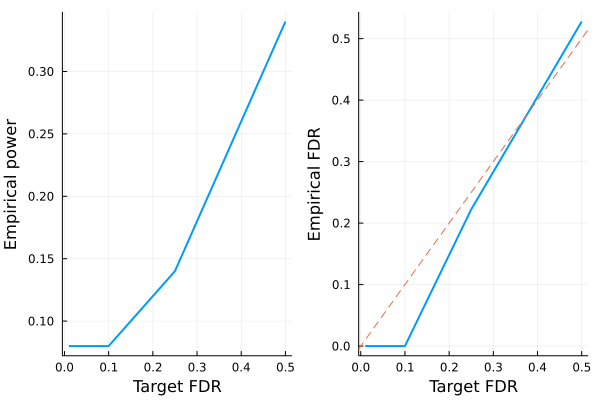

# Model-X knockoffs

This tutorial generates model-X knockoffs, which handles the cases where covariates outnumber sample size ($p > n$). The methodology is described in the following paper

> Candes E, Fan Y, Janson L, Lv J. *Panning for gold:‘model‐X’knockoffs for high dimensional controlled variable selection.* Journal of the Royal Statistical Society: Series B (Statistical Methodology). 2018 Jun;80(3):551-77.


```julia
# load packages needed for this tutorial
using Revise
using Knockoffs
using Plots
using Random
using GLMNet
using Distributions
using LinearAlgebra
using ToeplitzMatrices
using StatsBase
gr(fmt=:png);
```

## Gaussian model-X knockoffs with known mean and covariance

To illustrate, lets simulate data $\mathbf{X}$ with covariance $\Sigma$ and mean $\mu$. Our model is
```math
\begin{aligned}
    X_{p \times 1} \sim N(\mathbf{0}_p, \Sigma)
\end{aligned}
```
where
```math
\begin{aligned}
\Sigma = 
\begin{pmatrix}
    1 & \rho & \rho^2 & ... & \rho^p\\
    \rho & \rho^2 & & ... & \rho^{p-1}\\
    \vdots & & & \rho^2 & \vdots \\
    \rho^p & \cdots & & & 1
\end{pmatrix}
\end{aligned}
```
Given $n$ iid samples from the above distribution, we will generate knockoffs according to 
```math
\begin{aligned}
(X, \tilde{X}) \sim N
\left(0, \ 
\begin{pmatrix}
    \Sigma & \Sigma - diag(s)\\
    \Sigma - diag(s) & \Sigma
\end{pmatrix}
\right)
\end{aligned}
```
where $s$ is solved so that $0 \le s_j \le 1$ for all $j$ and $2Σ - diag(s)$ is PSD


```julia
Random.seed!(2022)
n = 100 # sample size
p = 200 # number of covariates
ρ = 0.4
Σ = Matrix(SymmetricToeplitz(ρ.^(0:(p-1)))) # true covariance matrix
μ = zeros(p) # true mean parameters
L = cholesky(Σ).L
X = randn(n, p) * L # var(X) = L var(N(0, 1)) L' = var(Σ)
```


    100×200 Matrix{Float64}:
     -0.877527   -1.30346    -0.682964   …  -0.817921   -0.443636    0.499729
      1.94981     0.625748   -0.157094       1.21112    -0.163149    0.350929
     -0.372347   -0.0577255  -0.545009       0.892292    0.163945    0.467362
      0.281239   -1.2314     -2.25883        0.317825    1.15744     1.49079
     -1.94197    -0.514252   -0.126406       0.0965242   1.05391     0.544561
      0.32584     1.29406    -0.944499   …   0.02042     1.42058     1.35037
      0.312506   -0.892288   -1.28543        2.19732    -0.780504   -0.439078
     -0.130798    0.080975   -1.00406        1.43054     1.05022     0.919655
     -1.37595    -1.7559     -0.965395      -0.355736   -0.990055   -0.576405
      1.17982     1.1271      1.29655       -1.77068    -0.28982    -0.955318
      0.328697    0.674708    1.08453    …   1.10681     0.927134    0.365789
     -0.155799    0.740727    0.0747548     -0.907985   -1.50862    -1.28484
     -2.03164    -0.90797    -1.57553       -0.320668   -0.552744   -0.759838
      ⋮                                  ⋱                          
     -0.950099   -1.38457     0.158824      -0.0403046  -0.780689    0.153704
      0.236699   -0.22054    -0.852487       1.15828     0.779439    1.22494
     -0.409184    0.393978    0.894276   …  -1.53352    -1.31078     0.53052
     -0.20095    -0.200403   -1.76704       -1.3792     -0.821225   -1.7945
     -0.366858    0.719476    0.234908      -0.14434     0.136396    0.0201093
     -0.232295    0.305845   -0.494038      -1.62919    -0.306324   -0.179342
      0.712566    0.86745     1.08866        0.360331   -0.673139   -0.048985
     -0.413006    0.322623    0.152769   …   0.344594   -0.206165    1.21382
      0.0977592  -0.301898    0.0328142     -1.12954    -1.37743    -0.0102951
      0.988324   -0.698384   -0.436609      -0.807328    0.692896   -0.577614
      0.132829    0.26532     1.60743        0.845794   -1.39747    -1.15872
     -0.525434   -0.854175    0.170717      -0.575015    0.0618822  -1.08147


To generate knockoffs, the 4 argument function [modelX\_gaussian\_knockoffs](https://biona001.github.io/Knockoffs.jl/dev/man/api/#Knockoffs.modelX_gaussian_knockoffs) will generate exact model-X knockoffs. The 2nd argument can be ither `:equi`, `:sdp`, or `:asdp`. The SDP construction will yield more powerful knockoffs, but is more computationally expensive. 


```julia
@time Xko_equi = modelX_gaussian_knockoffs(X, :equi, μ, Σ)
@time Xko_sdp = modelX_gaussian_knockoffs(X, :sdp, μ, Σ);
```

     29.307847 seconds (78.55 M allocations: 4.653 GiB, 5.12% gc time, 99.96% compilation time)
     27.398426 seconds (46.74 M allocations: 2.986 GiB, 4.20% gc time, 87.65% compilation time)


The return type is a `GaussianKnockoff` struct, which contains the following fields

```julia
struct GaussianKnockoff{T}
    X::Matrix{T}    # n × p original design matrix
    X̃::Matrix{T}    # n × p knockoff of X
    s::Vector{T}    # p × 1 vector. Diagonal(s) and 2Σ - Diagonal(s) are both psd
    Σ::Matrix{T}    # p × p gram matrix X'X
    method::Symbol # :sdp or :equi
end
```

Thus, to access these fields, one can do e.g.


```julia
s = Xko_sdp.s
```


    200-element Vector{Float64}:
     0.9999999975421989
     0.9714285562750639
     0.8114286000388236
     0.8754285608972914
     0.8498285802412486
     0.8600685709048966
     0.8559725752335535
     0.8576109732729927
     0.856955614169666
     0.8572177577255956
     0.8571129003675105
     0.8571548432807583
     0.8571380661077549
     ⋮
     0.8571548433098494
     0.8571129003234808
     0.8572177577571737
     0.8569556141700471
     0.8576109732517373
     0.8559725752488924
     0.860068570920087
     0.8498285802136867
     0.8754285609148045
     0.8114286000369729
     0.9714285562700409
     0.9999999975421956


## Second order knockoffs

The 2 argument [modelX\_gaussian\_knockoffs](https://biona001.github.io/Knockoffs.jl/dev/man/api/#Knockoffs.modelX_gaussian_knockoffs) will estimate the mean and covariance of `X` and use them to generate model-X knockoffs


```julia
# make equi-correlated and SDP knockoffs
@time equi = modelX_gaussian_knockoffs(X, :equi)
@time sdp = modelX_gaussian_knockoffs(X, :sdp);
```

      1.740616 seconds (4.75 M allocations: 299.641 MiB, 2.51% gc time, 99.25% compilation time)
      2.039740 seconds (497.05 k allocations: 401.086 MiB, 3.26% gc time, 0.01% compilation time)


## LASSO example

Let us apply the generated knockoffs to the model selection problem

> Given response $\mathbf{y}_{n \times 1}$, design matrix $\mathbf{X}_{n \times p}$, we want to select a subset $S \subset \{1,...,p\}$ of variables that are truly causal for $\mathbf{y}$. 

### Simulate data

We will simulate 

$$\mathbf{y} \sim N(\mathbf{X}\mathbf{\beta}, \mathbf{\epsilon}), \quad \mathbf{\epsilon} \sim N(0, 1)$$

where $k=50$ positions of $\mathbf{\beta}$ is non-zero with effect size $\beta_j \sim N(0, 1)$. The goal is to recover those 50 positions using LASSO.


```julia
# set seed for reproducibility
Random.seed!(2022)

# simulate true beta
n, p = size(X)
k = 50
βtrue = zeros(p)
βtrue[1:k] .= randn(50)
shuffle!(βtrue)

# find true causal variables
correct_position = findall(!iszero, βtrue)

# simulate y
y = X * βtrue + randn(n)
```


    100-element Vector{Float64}:
      -7.29683323745739
      -0.4827939678505152
      -3.166139669157895
      -3.1987955507535757
      -1.7423039385036772
      -6.990810699455535
      10.960121100350387
       0.504633936012002
       2.3957494965724537
       1.2234714855972766
       7.365843466230051
       5.712252157755721
      11.53507487010848
       ⋮
      -4.081805640484018
      -2.0995751341031137
      -0.7408465573414786
      -5.879606753417609
      -9.712640007178502
     -10.367158124718355
       5.951922169939996
       4.7064742789344844
     -10.607174668930146
       2.3073770740226824
      11.22462350764645
      -4.172212046930051


### Standard LASSO

Lets try running standard LASSO. We use LASSO solver in [GLMNet.jl](https://github.com/JuliaStats/GLMNet.jl) package, which is just a Julia wrapper for the GLMnet Fortran code. 

How does it perform in power and FDR?


```julia
# run 10-fold cross validation to find best λ minimizing MSE
lasso_cv = glmnetcv(X, y)
λbest = lasso_cv.lambda[argmin(lasso_cv.meanloss)]

# use λbest to fit LASSO on full data
@time βlasso = glmnet(X, y, lambda=[λbest]).betas[:, 1]

# check power and false discovery rate
power = length(findall(!iszero, βlasso) ∩ correct_position) / k
FDR = length(setdiff(findall(!iszero, βlasso), correct_position)) / count(!iszero, βlasso)
power, FDR
```

      0.103309 seconds (244.18 k allocations: 13.559 MiB, 93.99% compilation time)


    (0.66, 0.5875)


It seems LASSO have power 96% (it missed only 2/50 predictors), but the false discovery rate is 54%. This means that although LASSO finds almost every predictor, more than half of all discoveries are false positives. 

### Knockoff+LASSO

Now lets try applying the knockoff methodology. Recall that consists of a few steps 

1. Run LASSO on $[\mathbf{X} \mathbf{\tilde{X}}]$
2. Compare feature importance score $W_j = \text{score}(x_j) - \text{score}(\tilde{x}_j)$ for each $j = 1,...,p$. Here we use $W_j = |\beta_j| - |\tilde{\beta}_{j}|$
3. Choose target FDR $q \in [0, 1]$ and compute 
$$\tau = min_{t}\left\{t > 0: \frac{{\{\#j: W_j ≤ -t}\}}{max(1, {\{\#j: W_j ≥ t}\})} \le q\right\}$$


!!! note
    
    In step 1, $[\mathbf{X} \mathbf{\tilde{X}}]$ is written for notational convenience. In practice one must interleave knockoffs with the original variables, where either the knockoff come first or the original genotype come first with equal probability. This is due to the inherent bias of LASSO solvers: when the original and knockoff variable are equally valid, the one listed first will be selected. 


```julia
@time knockoff_filter = fit_lasso(y, sdp.X, sdp.X̃);
```

      2.686089 seconds (7.02 M allocations: 421.260 MiB, 1.67% gc time, 93.93% compilation time)


The return type is now a `KnockoffFilter`, which contains the following information

```julia
struct KnockoffFilter{T}
    XX̃ :: Matrix{T} # n × 2p matrix of original X and its knockoff interleaved randomly
    original :: Vector{Int} # p × 1 vector of indices of XX̃ that corresponds to X
    knockoff :: Vector{Int} # p × 1 vector of indices of XX̃ that corresponds to X̃
    W :: Vector{T} # p × 1 vector of feature-importance statistics for fdr level fdr
    βs :: Vector{Vector{T}} # βs[i] is the p × 1 vector of effect sizes corresponding to fdr level fdr_target[i]
    a0 :: Vector{T}   # intercepts for each model in βs
    τs :: Vector{T}   # knockoff threshold for selecting Ws correponding to each FDR
    fdr_target :: Vector{T} # target FDR level for each τs and βs
    debiased :: Bool # whether βs and a0 have been debiased
end
```

Given these information, we can e.g. visualize power and FDR trade-off:


```julia
FDR = knockoff_filter.fdr_target
empirical_power = Float64[]
empirical_fdr = Float64[]
for i in eachindex(FDR)
    # extract beta for current fdr
    βknockoff = knockoff_filter.βs[i]
    
    # compute power and false discovery proportion
    power = length(findall(!iszero, βknockoff) ∩ correct_position) / k
    fdp = length(setdiff(findall(!iszero, βknockoff), correct_position)) / max(count(!iszero, βknockoff), 1)
    push!(empirical_power, power)
    push!(empirical_fdr, fdp)
end

# visualize FDR and power
power_plot = plot(FDR, empirical_power, xlabel="Target FDR", ylabel="Empirical power", legend=false, w=2)
fdr_plot = plot(FDR, empirical_fdr, xlabel="Target FDR", ylabel="Empirical FDR", legend=false, w=2)
Plots.abline!(fdr_plot, 1, 0, line=:dash)
plot(power_plot, fdr_plot)
```





**Conclusion:** Compared to LASSO, knockoff's empirical FDR is controlled below the target FDR (dashed line). Controlled FDR is compensated by a small price in power. If this experiment is repeated multiple times, we expected the empirical FDR to hug the target (dashed) line more closely. 
