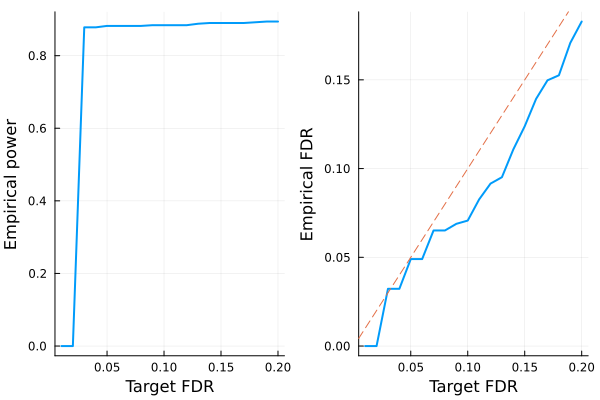

# Model-X knockoffs

This tutorial is for generating model-X (Gaussian) knockoffs, which handles cases where covariates outnumber sample size ($p > n$). The methodology is described in the following paper

> Candes E, Fan Y, Janson L, Lv J. *Panning for gold:‘model‐X’knockoffs for high dimensional controlled variable selection.* Journal of the Royal Statistical Society: Series B (Statistical Methodology). 2018 Jun;80(3):551-77.


```julia
# load packages needed for this tutorial
using Knockoffs
using Random
using GLMNet
using Distributions
using LinearAlgebra
using ToeplitzMatrices
using StatsKit
using Plots
gr(fmt=:png);
```

## Gaussian model-X knockoffs with known mean and covariance

To illustrate, lets simulate data $\mathbf{X}$ with covariance $\Sigma$ and mean $\mu$. Our model is
```math
\begin{aligned}
    X_{p \times 1} \sim N(\mathbf{0}_p, \Sigma)
\end{aligned}
```
where
```math
\begin{aligned}
\Sigma = 
\begin{pmatrix}
    1 & \rho & \rho^2 & ... & \rho^p\\
    \rho & 1 & & ... & \rho^{p-1}\\
    \vdots & & & 1 & \vdots \\
    \rho^p & \cdots & & & 1
\end{pmatrix}
\end{aligned}
```
Given $n$ iid samples from the above distribution, we will generate knockoffs according to 
```math
\begin{aligned}
(X, \tilde{X}) \sim N
\left(0, \ 
\begin{pmatrix}
    \Sigma & \Sigma - diag(s)\\
    \Sigma - diag(s) & \Sigma
\end{pmatrix}
\right)
\end{aligned}
```
where $s$ is solved so that $0 \le s_j \le \Sigma_{jj}$ for all $j$ and $2Σ - diag(s)$ is PSD. 


```julia
Random.seed!(2022)
n = 500 # sample size
p = 1000 # number of covariates
ρ = 0.4
Σ = Matrix(SymmetricToeplitz(ρ.^(0:(p-1)))) # true covariance matrix
μ = zeros(p) # true mean parameters
L = cholesky(Σ).L
X = randn(n, p) * L # var(X) = L var(N(0, 1)) L' = var(Σ)
```


    500×1000 Matrix{Float64}:
     -0.255643    0.12145      1.90832   …  -0.425334  -0.0875185  -1.26044
      1.21857    -1.04975     -1.93608       0.986266   0.495375    0.526645
     -0.489054   -0.325137    -0.389752     -0.54062   -0.765207   -0.925541
      1.13077     0.715132     0.115053     -0.866809   0.835603    1.41018
     -2.06667    -0.799976     0.104784     -1.10473   -1.53618    -1.48403
     -0.692878   -1.04012     -0.711309  …   0.117786   0.419314    1.05
      0.605767   -0.220341    -0.62107       1.36572   -0.454627   -0.226038
     -0.156307    0.0225261   -0.117329      1.06143    1.35028     1.0699
      0.443743    2.41354      0.635028      0.744278   0.229644   -0.640157
      0.710929    0.0527427    1.35858       1.06147   -0.142669   -1.67164
      0.785485    1.72134     -1.02638   …  -0.222289  -0.903092   -0.237564
     -0.0330742   1.02192      0.367135     -0.412167   0.127533   -0.0828143
     -2.01006    -0.858529    -0.817414      1.52695    1.67114     2.15544
      ⋮                                  ⋱                         
     -0.324703    0.476295     0.106425     -1.06599   -1.88418    -1.02433
     -0.811388    0.00190805  -1.16822       0.780591   1.11014    -0.208461
     -0.184579    0.344966    -0.648001  …   1.21303   -0.403468   -2.11791
      1.27172     2.03987      1.4584       -0.819745   0.0938613   0.114038
     -0.688407    0.0815265   -0.503051      0.283407  -1.10525     0.131074
     -0.892244   -0.184611    -0.746692     -0.87555   -2.00235    -0.291364
      1.57011     0.315036     1.35995       0.582807  -0.68021    -1.27912
     -0.503994   -1.70271     -0.186807  …  -0.67245   -1.07302    -0.755238
     -0.437047    0.27435     -0.821421     -1.33403   -0.368807   -0.0284317
     -2.81068    -0.361046     1.19981      -1.29837   -0.151723    1.00562
     -1.54038     0.403661     0.545421      0.728631  -1.2155      0.577002
      0.194411    0.885717     0.54569      -0.753762  -1.55452    -0.416219


To generate model-X knockoffs,
+ The 4 argument function [`modelX_gaussian_knockoffs`](https://biona001.github.io/Knockoffs.jl/dev/man/api/#Knockoffs.modelX_gaussian_knockoffs) will generate exact model-X knockoffs. 
+ First argument is the design matrix `X`. 
+ The second argument specifies the optimization method to generate knockoffs. We recommend `:mvr` or `:maxent` because they are [more efficient to compute and tend to be more powerful than the SDP construction](https://projecteuclid.org/journals/annals-of-statistics/volume-50/issue-1/Powerful-knockoffs-via-minimizing-reconstructability/10.1214/21-AOS2104.short). 
+ The 3rd and 4th argument supplies the true mean and covariance of features.


```julia
# for larger problems, consider including `verbose=true` argument to monitor convergence
@time equi = modelX_gaussian_knockoffs(X, :equi, μ, Σ)
@time mvr = modelX_gaussian_knockoffs(X, :mvr, μ, Σ)
@time me = modelX_gaussian_knockoffs(X, :maxent, μ, Σ);
```

      7.125893 seconds (32.71 M allocations: 1.647 GiB, 8.21% gc time, 145.24% compilation time: 32% of which was recompilation)
      3.375217 seconds (118 allocations: 111.770 MiB, 0.46% gc time)
      1.949526 seconds (112 allocations: 111.754 MiB, 0.24% gc time)


The return type is a `GaussianKnockoff` struct, which contains the following fields

```julia
struct GaussianKnockoff{T<:AbstractFloat, M<:AbstractMatrix, S <: Symmetric} <: Knockoff
    X::M # n × p design matrix
    Xko::Matrix{T} # n × mp knockoff of X
    s::Vector{T} # p × 1 vector. Diagonal(s) and 2Sigma - Diagonal(s) are both psd
    Sigma::S # p × p symmetric covariance matrix. 
    method::Symbol # method for solving s
    m::Int # number of knockoffs per feature generated
end
```

Thus, to access these fields, one can do e.g.


```julia
s = mvr.s
```


    1000-element Vector{Float64}:
     0.7055844308562429
     0.550600272751968
     0.5579639876207408
     0.5578996993527634
     0.5578836894402361
     0.557884931529107
     0.5578848927508965
     0.5578848919247209
     0.5578848920850612
     0.5578848920756359
     0.5578848920748058
     0.55788489207387
     0.5578848920729174
     ⋮
     0.5578848730690337
     0.5578848733890447
     0.5578848767064315
     0.5578848743329565
     0.5578848745291352
     0.5578848757524278
     0.5578849142012808
     0.5578836722536308
     0.5578996821189731
     0.557963970313357
     0.5506002575404034
     0.7055843980219573


```julia
# compare s values for different methods
[me.s mvr.s equi.s]
```


    1000×3 Matrix{Float64}:
     0.760607  0.705584  0.857145
     0.599795  0.5506    0.857145
     0.611403  0.557964  0.857145
     0.610539  0.5579    0.857145
     0.610604  0.557884  0.857145
     0.610599  0.557885  0.857145
     0.610599  0.557885  0.857145
     0.610599  0.557885  0.857145
     0.610599  0.557885  0.857145
     0.610599  0.557885  0.857145
     0.610599  0.557885  0.857145
     0.610599  0.557885  0.857145
     0.610599  0.557885  0.857145
     ⋮                   
     0.610599  0.557885  0.857145
     0.610599  0.557885  0.857145
     0.610599  0.557885  0.857145
     0.610599  0.557885  0.857145
     0.610599  0.557885  0.857145
     0.610599  0.557885  0.857145
     0.610599  0.557885  0.857145
     0.610603  0.557884  0.857145
     0.610539  0.5579    0.857145
     0.611403  0.557964  0.857145
     0.599795  0.5506    0.857145
     0.760607  0.705584  0.857145


## Second order knockoffs

In practice, one usually do not have access to true mean `\mu` and covariance `\Sigma`. Thus, we provide routines to estimate them from data. In our software, the covariance is approximated by a shrinkage method (default = ledoit wolf) rather than using the sample covariance, see API for detail. 

The 2 argument [`modelX_gaussian_knockoffs`](https://biona001.github.io/Knockoffs.jl/dev/man/api/#Knockoffs.modelX_gaussian_knockoffs) will estimate the mean and covariance of `X` and use them to generate model-X knockoffs


```julia
# make 2nd order knockoffs
@time me_2nd_order = modelX_gaussian_knockoffs(X, :maxent);
```

      2.520655 seconds (16.14 M allocations: 956.718 MiB, 6.84% gc time, 22.97% compilation time)


## Approximate construction for speed

Generating model-X knockoffs scales as $\mathcal{O}(p^3)$ with coordinate descent (e.g. `sdp_fast`, `mvr`, `maxent`), which becomes prohibitively slow for large $p$ (e.g. $p = 5000$). 

Sometimes one expects that covariates are only correlated with its nearby neighbors. Then, we can approximate the covariance matrix as a block diagonal structure with block size `windowsize`, and solve each block independently as smaller problems. This is implemented as [approx\_modelX\_gaussian\_knockoffs](https://biona001.github.io/Knockoffs.jl/dev/man/api/#Knockoffs.approx_modelX_gaussian_knockoffs)


```julia
@time me_approx = approx_modelX_gaussian_knockoffs(X, :maxent, windowsize=100);
```

      2.251278 seconds (11.44 M allocations: 725.025 MiB, 16.44% gc time, 91.19% compilation time: 1% of which was recompilation)


## Multiple knockoffs

[Gimenez et al](http://proceedings.mlr.press/v89/gimenez19b.html) suggested multiple simultaneous knockoffs, which can give a boost in power when the target FDR or the number of variables to select are low. 

If one generated $m$ knockoffs for each of the $p$ variables, the convex optimization problem in solving for diagonal $S$ matrix is equally efficient as in the single-knockoff case, but the subsequent model selection would have $(m + 1) * p$ columns as opposed to $2p$ columns in the single-knockoff case. Thus, both computational speed and memory demand scales roughly linearly in $m$. 


```julia
m = 5
@time me_multiple = modelX_gaussian_knockoffs(X, :maxent, μ, Σ, m=m);
```

      2.147245 seconds (14.09 M allocations: 898.591 MiB, 5.13% gc time, 0.31% compilation time)


As a sanity check, lets make sure the modified SDP constraint is satisfied


```julia
eigmin((m+1)/m * Σ - Diagonal(me_multiple.s))
```


    0.14792714564321696


Finally, we can compare the `s` vector estimated from all 4 methods.


```julia
[me.s me_2nd_order.s me_approx.s me_multiple.s]
```


    1000×4 Matrix{Float64}:
     0.760607  0.993067  0.841361  0.456365
     0.599795  0.834209  0.645421  0.359877
     0.611403  1.05169   0.785846  0.366842
     0.610539  0.958049  0.72226   0.366324
     0.610604  0.88295   0.689608  0.366362
     0.610599  0.896043  0.706307  0.366359
     0.610599  0.951743  0.714917  0.36636
     0.610599  0.858261  0.634524  0.36636
     0.610599  0.937609  0.703356  0.36636
     0.610599  0.921111  0.716523  0.36636
     0.610599  0.956954  0.701466  0.36636
     0.610599  0.978661  0.725032  0.36636
     0.610599  0.915266  0.687777  0.36636
     ⋮                             
     0.610599  0.923909  0.724098  0.36636
     0.610599  0.922613  0.715423  0.36636
     0.610599  0.968706  0.761479  0.36636
     0.610599  0.86303   0.686886  0.36636
     0.610599  1.02565   0.779176  0.36636
     0.610599  0.996824  0.739476  0.36636
     0.610599  0.939156  0.706557  0.366359
     0.610603  0.998181  0.755468  0.366362
     0.610539  0.862945  0.66368   0.366324
     0.611403  0.979566  0.796942  0.366842
     0.599795  0.868131  0.690362  0.359877
     0.760607  0.746526  0.621652  0.456364


In this example, they are quite different.

## LASSO example

Let us apply the generated knockoffs to the model selection problem

> Given response $\mathbf{y}_{n \times 1}$, design matrix $\mathbf{X}_{n \times p}$, we want to select a subset $S \subset \{1,...,p\}$ of variables that are truly causal for $\mathbf{y}$. 

### Simulate data

We will simulate 

$$\mathbf{y} \sim N(\mathbf{X}\mathbf{\beta}, \mathbf{\epsilon}), \quad \mathbf{\epsilon} \sim N(0, 1)$$

where $k=50$ positions of $\mathbf{\beta}$ is non-zero with effect size $\beta_j \sim N(0, 1)$. The goal is to recover those 50 positions using LASSO.


```julia
# set seed for reproducibility
Random.seed!(123)

# simulate true beta
n, p = size(X)
k = 50
βtrue = zeros(p)
βtrue[1:k] .= randn(k)
shuffle!(βtrue)

# find true causal variables
correct_position = findall(!iszero, βtrue)

# simulate y
y = X * βtrue + randn(n)
```


    500-element Vector{Float64}:
       0.3992934096573465
      -6.5243227546954135
      -4.2196474923348815
      -1.202986255773777
      -0.08411614246816024
       9.019037891045716
       2.291638778580847
      -5.3586494081447364
       1.0292363381552607
      -6.6686609696568
     -11.707786675967569
      12.327054280025447
      -6.418734882548746
       ⋮
      -7.507380618056459
       5.192605185451283
      -5.207934010911712
      -3.9566157936324977
       1.8451860033906173
      11.597088336622672
      -2.5311163428947356
     -14.794701710144432
       9.246075787788433
       7.598003757757486
       3.3562674636290426
       0.9990196086937622


### Standard LASSO

Lets try running standard LASSO. We use LASSO solver in [GLMNet.jl](https://github.com/JuliaStats/GLMNet.jl) package, which is just a Julia wrapper for the GLMnet Fortran code. 

How does it perform in power and FDR?


```julia
# run 10-fold cross validation to find best λ minimizing MSE
lasso_cv = glmnetcv(X, y)
λbest = lasso_cv.lambda[argmin(lasso_cv.meanloss)]

# use λbest to fit LASSO on full data
βlasso = glmnet(X, y, lambda=[λbest]).betas[:, 1]

# check power and false discovery rate
power = length(findall(!iszero, βlasso) ∩ correct_position) / k
FDR = length(setdiff(findall(!iszero, βlasso), correct_position)) / count(!iszero, βlasso)
println("Lasso power = $power, FDR = $FDR")
```

    Lasso power = 0.92, FDR = 0.7591623036649214


More than half of all Lasso discoveries are false positives. 

### Knockoff+LASSO

Now lets try applying the knockoff methodology on a simulated data. The [`fit_lasso`](https://biona001.github.io/Knockoffs.jl/dev/man/api/#Knockoffs.fit_lasso) function generates knockoffs, run Lasso on $[\mathbf{X} \mathbf{\tilde{X}}]$, and apply knockoff filter.


```julia
@time knockoff_filter = fit_lasso(y, X, method=:maxent, m=1);
```

      4.093250 seconds (3.54 M allocations: 474.585 MiB, 5.76% gc time, 16.80% compilation time)


The return type is now a `LassoKnockoffFilter`, which contains the following information

```julia
struct LassoKnockoffFilter{T} <: KnockoffFilter
    y :: Vector{T} # n × 1 response vector
    X :: Matrix{T} # n × p matrix of original features
    ko :: Knockoff # A knockoff struct
    m :: Int # number of knockoffs per feature generated
    beta :: Vector{T} # full lasso coefficients before q-value thresholding
    a0 :: T   # intercept for the full lasso model
    W :: Vector{T} # length p vector of feature importance
    qvalues :: Vector{Float64} # knockoff q-values
    stat_groups :: Union{Nothing, Vector{Int}} # group labels corresponding to W/qvalues entries
    d :: UnivariateDistribution # distribution of y
    debias :: Union{Nothing, Symbol} # how betas and a0 have been debiased (`nothing` for not debiased)
    stringent :: Bool # group debiasing behavior
end
```

For instance, to get selected variables at 10% FDR:


```julia
selected = select_variables(knockoff_filter, 0.1)
```


    51-element Vector{Int64}:
       2
       4
       8
      17
      43
      98
     101
     105
     121
     174
     178
     179
     227
       ⋮
     825
     834
     852
     853
     874
     913
     924
     925
     939
     947
     975
     989


Lets do 10 simulations and visualize power and FDR trade-off:


```julia
# run 10 simulations and compute empirical power/FDR
nsims = 10
FDR = collect(0.01:0.01:0.2)
empirical_power = zeros(length(FDR))
empirical_fdr = zeros(length(FDR))
Random.seed!(123)
for sim in 1:nsims
    @time knockoff_filter = fit_lasso(y, X, method=:maxent, m=1)
    for (j, fdr) in enumerate(FDR)
        selected = select_variables(knockoff_filter, fdr)
        power = length(selected ∩ correct_position) / k
        fdp = length(setdiff(selected, correct_position)) / max(length(selected), 1)
        empirical_power[j] += power
        empirical_fdr[j] += fdp
    end
end
empirical_power ./= nsims
empirical_fdr ./= nsims

# visualize FDR and power
power_plot = plot(FDR, empirical_power, xlabel="Target FDR", ylabel="Empirical power", legend=false, w=2)
fdr_plot = plot(FDR, empirical_fdr, xlabel="Target FDR", ylabel="Empirical FDR", legend=false, w=2)
Plots.abline!(fdr_plot, 1, 0, line=:dash)
plot(power_plot, fdr_plot)
```

      3.163301 seconds (1.33 k allocations: 325.157 MiB, 1.20% gc time)
      3.473688 seconds (1.33 k allocations: 319.829 MiB, 8.97% gc time)
      3.136128 seconds (1.33 k allocations: 311.423 MiB, 0.19% gc time)
      3.117168 seconds (1.33 k allocations: 308.376 MiB, 0.22% gc time)
      3.775784 seconds (1.33 k allocations: 316.766 MiB, 6.23% gc time)
      3.884937 seconds (1.33 k allocations: 322.876 MiB, 9.71% gc time)
      3.293645 seconds (1.33 k allocations: 312.188 MiB, 0.37% gc time)
      3.136747 seconds (1.33 k allocations: 308.376 MiB, 0.22% gc time)
      3.141166 seconds (1.33 k allocations: 308.376 MiB, 0.19% gc time)
      3.643675 seconds (1.33 k allocations: 317.532 MiB, 10.59% gc time)





**Conclusion:** 

+ LASSO + knockoffs controls the false discovery rate at below the target (dashed line). 
+ The power of standard LASSO is better, but it comes with high empirical FDR that one cannot control via cross validation. 
+ If one does not have the true mean and covariance of the $p$ dimensional covariates, Knockoffs.jl will estimate them with sample mean and a shrunken (default = ledoit wolf) estimator. 
+ Multiple simultaneous knockoffs increases power at the expensive of larger regression problem. 
+ Approximate constructions can be leveraged for extremely large problems, e.g. $p > 10000$. 
